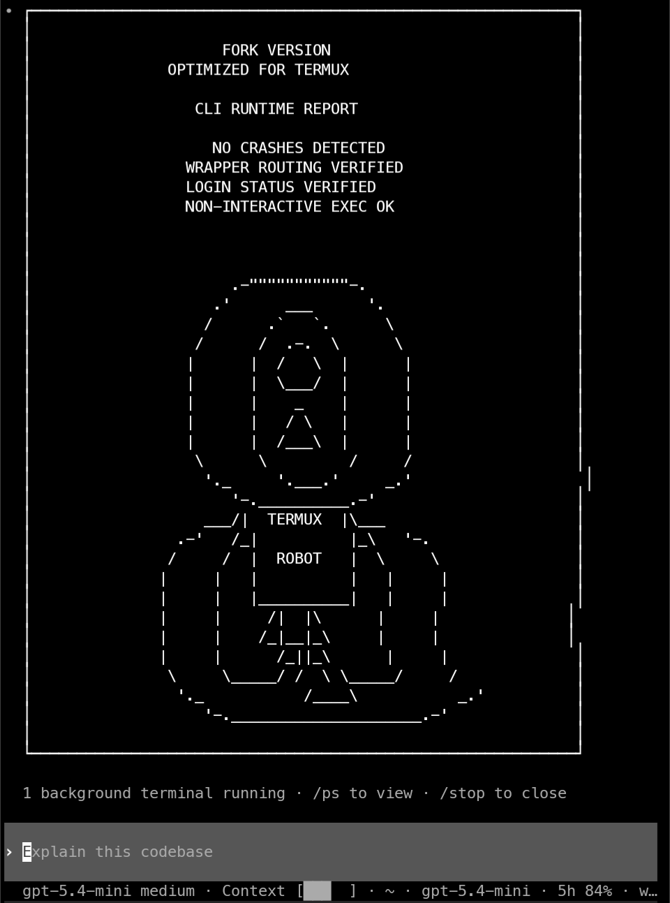

# Codex Termux

> Native Codex CLI for **Termux / Android ARM64**.
> This fork tracks upstream OpenAI Codex main and carries only the Android/Termux compatibility delta needed to package and run it.

[](https://www.npmjs.com/package/@mmmbuto/codex-cli-termux)
[](https://github.com/DioNanos/codex-termux/releases/latest)

<p align="center">
  
</p>

## Install

### Termux (Android ARM64)

```bash
pkg update && pkg upgrade -y
pkg install nodejs-lts -y
npm install -g @mmmbuto/codex-cli-termux@latest
codex --version
codex login
```

Requirements:

- Android 7+ / API 24+
- ARM64 device
- Node.js >= 18

## Scope

What this fork does:

- tracks upstream OpenAI Codex closely
- builds native Android ARM64 binaries for Termux
- applies only the compatibility patches upstream does not ship
- publishes GitHub release assets and an npm package for Termux users

What this fork does not do:

- maintain a broad feature fork
- replace upstream Codex
- carry fork-only product features unrelated to Termux compatibility

## Current Termux Delta

- browser login uses `termux-open-url`
- self-update points to `DioNanos/codex-termux` and `@mmmbuto/codex-cli-termux`
- packaged wrappers preserve `CODEX_SELF_EXE`, sanitize `LD_LIBRARY_PATH`, and bundle `libc++_shared.so`
- Android binaries are linked with `RUNPATH=$ORIGIN`
- `exec`/code-mode now runs for real on Android via the in-process V8 runtime (no longer a stub) — the meaningful capability gain on Termux
- realtime voice/audio builds for Android but is not usable in Termux CLI (the cpal/oboe backend needs an Android JavaVM/Activity that Termux CLI lacks); the experimental `/realtime` and `/settings` commands cannot open an audio device there. The backend is intentionally left unchanged; Termux-native audio is tracked on the Codex VL roadmap.
- Android PTY and lock-handling compatibility patches remain enabled where upstream behavior still breaks on Bionic/Termux

## Releases and Updates

- Latest GitHub release: [releases/latest](https://github.com/DioNanos/codex-termux/releases/latest)
- Upstream base: OpenAI Codex `rust-v0.139.0`, packaged as `0.139.0` (npm `latest`). The `stable` dist-tag stays on `0.135.0` for conservative installs.
- npm package: [`@mmmbuto/codex-cli-termux`](https://www.npmjs.com/package/@mmmbuto/codex-cli-termux)
- Legacy `@mmmbuto/codex-cli-lts` (OpenAI Codex 0.80.x) is archived; current builds live in this package or in [`@mmmbuto/codex-vl`](https://www.npmjs.com/package/@mmmbuto/codex-vl) (multi-platform).

Maintainer publish flow:

- land validated changes on `develop`
- publish the tested npm package to `latest`
- promote the tested commit to clean GitHub `main`
- publish the GitHub release from `main`
- add post-release Termux validation reports after device testing

## Documentation

- [Changelog](./CHANGELOG.md)
- [Patch inventory](./patches/README.md)
- [Building from source](./BUILDING.md)
- Latest runtime validation report: [v0.139.0 Termux device validation](./test-report/CODEX_TEST_REPORT_v0.139.0_run_20260611-0957.md)
- [Install docs](./docs/install.md)
- [Authentication](./docs/authentication.md)
- [Configuration](./docs/config.md)

## License

This project remains under the Apache 2.0 license inherited from OpenAI Codex.

- Original work: OpenAI
- Termux port: minimal Android compatibility patches

See [LICENSE](./LICENSE).
